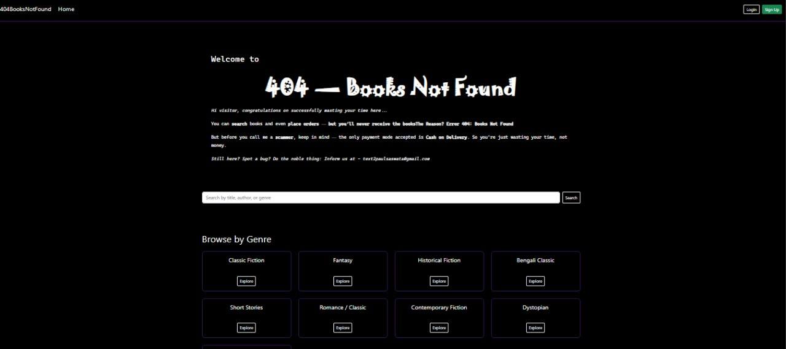
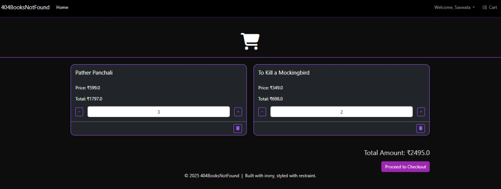
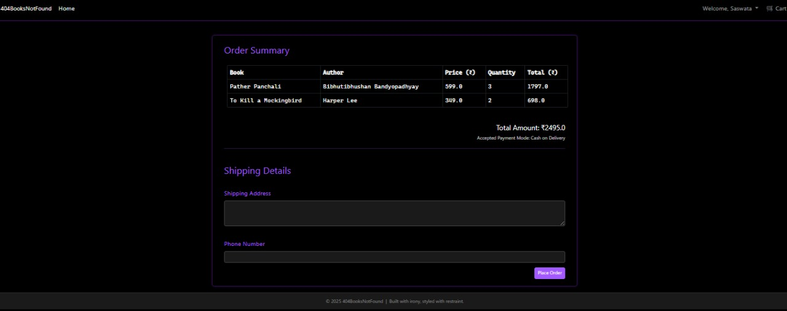
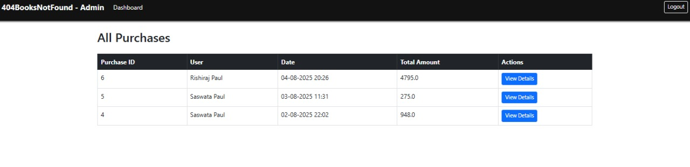

# 404-Books-Not-Found
404 Books Not Found is an online bookstore management system built with Spring MVC and Thymeleaf. It features admin and customer roles, book browsing, cart, order placement. Designed as a learning project for MVC architecture and Hibernate integration.


## 🚀 Tech Stack

- **Backend:** Spring MVC (XML + Annotations), Hibernate ORM, MySQL
- **Frontend:** Thymeleaf, Bootstrap 5, HTML, CSS, JavaScript, SweetAlert
- **Server:** Apache Tomcat 9 (WAR-based deployment)
- **IDE:** NetBeans
- **Build Tool:** Maven


## 🧠 Key Concepts Practiced

- **Spring MVC Flow** – `DispatcherServlet`, Controllers, Handler Mappings, View Resolvers
- **Thymeleaf** for dynamic HTML templating instead of JSP
- **DAO-Service-Controller architecture**
- **IoC and Dependency Injection** using `@Autowired`
- **Session tracking**, model binding, and `RedirectAttributes`
- **Hibernate ORM**:
  - transaction manager
  - One-to-Many and Many-to-One relationships
  - Cascading, orphan removal
  - Lazy vs Eager loading
- **HQL and Hibernate session management**
- **Role-based access** without using Spring Security

---

## 🔑 Features

### 👤 Customer

- User registration and login
- Browse/search books by keyword
- Add to cart, change quantity, remove items
- Checkout with shipping address and phone (no payment gateway)
- View purchase history

### 👨‍💼 Admin

- Admin login (role checked from DB)
- View all users and purchases
- Add new books with stock, genre, price, image
- Update or delete books

---

## 🛠️ Getting Started

### 1. 📁 Clone the Repo

```bash
git clone https://github.com/21spl/404-Books-Not-Found.git
```
### 2. ⚙️ Database Configuration
This project uses MySQL. You need to:
- Create a database (e.g., books_db)
- Import the schema using schema.sql (see next section)
- Configure your DB credentials in webapp/WEB-INF/dispatcher-servlet.xml
Edit the file:
<!-- dispatcher-servlet.xml -->
<bean id="dataSource" class="org.springframework.jdbc.datasource.DriverManagerDataSource">
    <property name="driverClassName" value="com.mysql.cj.jdbc.Driver" />
    <property name="url" value="url_to_your_local_db" />
    <property name="username" value="your_mysql_username" />
    <property name="password" value="your_mysql_password" />
</bean>

### 3. Import the schema
You can generate and import the schema using one of these:

Option A: Use schema.sql
Use the provided schema.sql file (in /database folder or root) to create tables.

In MySQL Workbench:

```sql
SOURCE path/to/schema.sql;
```
Or use terminal:

```bash
mysql -u root -p books_db < schema.sql
```

Option B: Generate Schema Yourself
If you've already created your DB with Hibernate:
- Go to MySQL Workbench
- Select your schema > Server > Data Export
- Choose Dump structure only and export as schema.sql


### 4. ▶️ Run the App
- Deploy on Apache Tomcat 9
- WAR file will be generated via Maven
- Login using:
  - Admin credentials stored in DB (e.g., admin@gmail.com)
  - Or register as a Customer
 

## Screenshots

### 🏠 Home Page


### 🛒 Cart Page


### ✅ Checkout Page


### 📜 Purchase History


### 📚 Admin - View Books


### 📦 Admin - View Purchases


### 🛠️ Admin Dashboard


